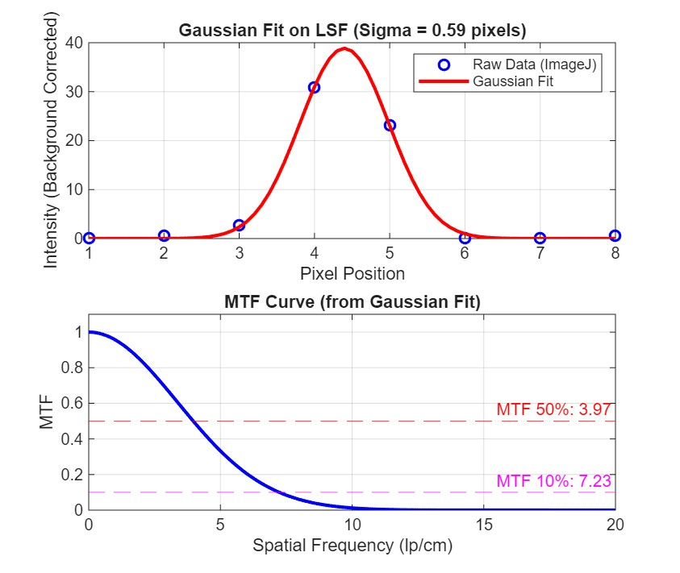
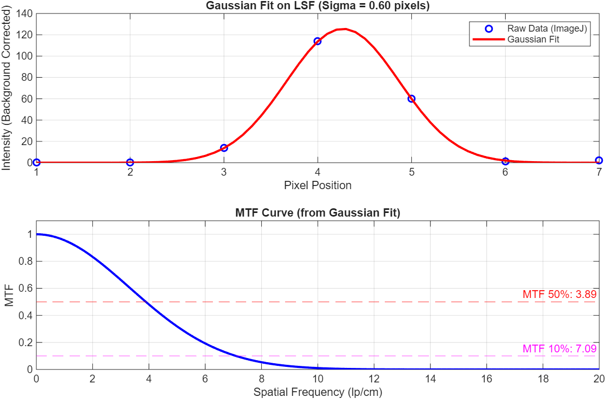
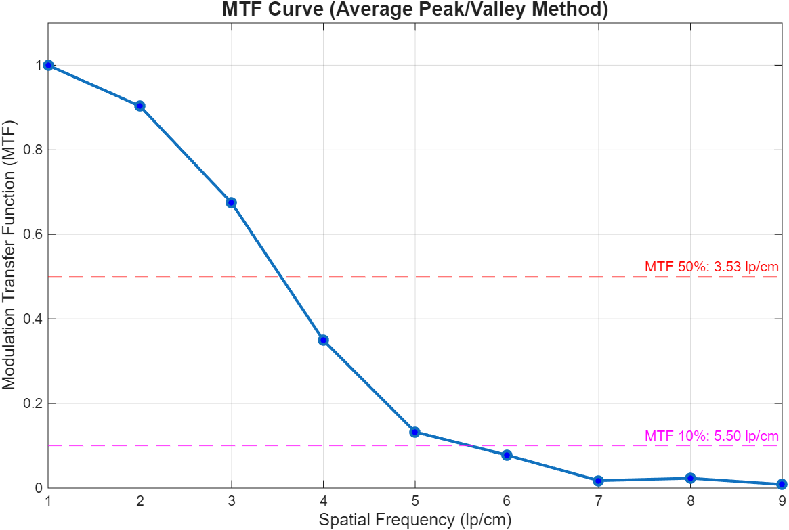
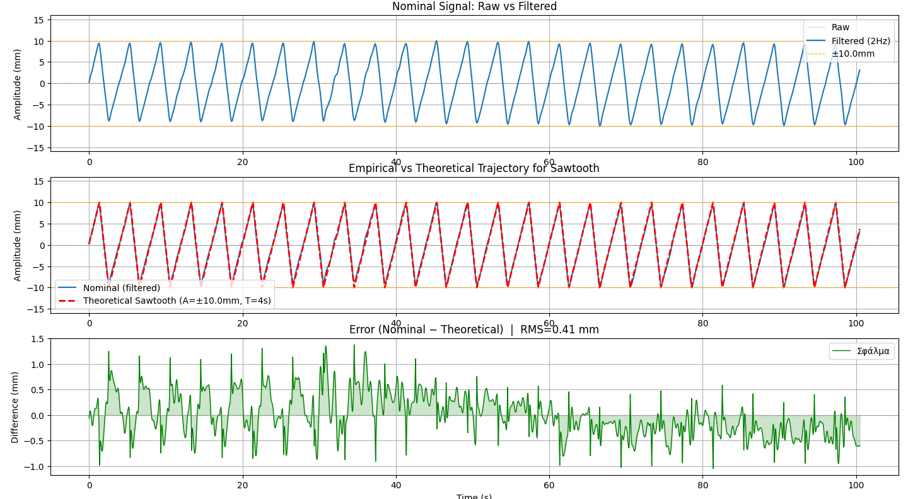

# Quality-Assurance-in-4D-Computed-Tomography
4D-CT Quality Assurance & Motion Tracking Analytics

## Overview
This repository contains the data extraction, signal processing, and analytical software toolkit developed for my Bachelor Thesis in Physics: **"Quality Assurance in 4D Computed Tomography"** (Aristotle University of Thessaloniki & St. Luke's Hospital). 

The project evaluates the geometric and volumetric accuracy of 4D-CT scanners when tracking moving targets (tumors) under various respiratory patterns. The custom algorithms in this repository were built to bypass proprietary "black-box" software, allowing for direct processing of raw DICOM waveforms, theoretical mathematical modeling, and rigorous Spatial Resolution (MTF) analysis.

---

## Repository Architecture

### 1. DICOM Waveform Extraction (`Python`)
*Extracts and digitizes the respiratory surrogate signal recorded by the CT scanner.*
*   **Deep DICOM Parsing:** Reads the `WaveformSequence` directly from the DICOM headers.
*   **Byte Decoding:** Dynamically maps the `WaveformSampleInterpretation` (e.g., `US`, `SS`) to decode the raw byte buffers.
*   **Physical Scaling:** Applies `ChannelSensitivity`, `CorrectionFactor`, and `Baseline` metadata to convert raw analog-to-digital values into exact physical displacements (mm) and exports them to CSV.

### 2. Respiratory Signal Processing & Modeling (`Python`)
*Evaluates the mechanical fidelity of the Dynamic Thorax Phantom across three 3D trajectories: Sinusoidal, $cos^6$, and Sawtooth.*
*   **Noise Filtration:** Applies baseline centering and a 4th-order Low-Pass Butterworth filter (via `scipy.signal`) to eliminate high-frequency mechanical noise.
*   **Mathematical Optimization:** Employs brute-force fitting algorithms to align theoretical motion models against the empirical tracking data.
*   **Cycle-by-Cycle Statistics:** Automatically detects signal peaks (`find_peaks`) and calculates the Root Mean Square (RMS) error and standard deviations per individual breathing cycle to quantify temporal and spatial latency.

### 3. Spatial Resolution & MTF Calculation (`MATLAB`)
*Quantifies the spatial frequency limits of the CT scanner using the Catphan® 604 phantom.*
*   **Gaussian Fitting Method (Point/Wire Sources):** Fits a continuous Gaussian curve to the discrete raw pixel data (LSF) using `fminsearch`, mitigating aliasing and background noise. Computes the FFT to extract the exact Modulation Transfer Function (MTF) at 50% and 10%.
*   **Peak-Valley Method (Bar Patterns):** Calculates the Contrast Transfer Function (CTF) utilizing local minima and maxima across varying line-pair frequencies (lp/cm).

<p align="center">
  
  <br>
  
  <br>
  <em>Figure 1: Modulation Transfer Function (MTF) using the bead source and angled wire respectively. The Line Spread Function (LSF) profile: raw pixel data (blue dots) are fitted with a Gaussian curve (red line) to correct for noise and undersampling. The calculated MTF curve derived from the Fourier Transform of the fitted Gaussian, showing the spatial frequencies at 50% and 10% modulation.</em>
</p>

<p align="center">
  
  <br>
  <em>Figure 2: Contrast Transfer Function (CTF) curve obtained from the discrete line pairs of the CTP732 module using the Peak-Valley method. The data points represent the modulation depth measured at specific spatial frequencies. The curve demonstrates a 50% contrast resolution at 3.53 lp/cm, reflecting the impact of aliasing and standard sampling on image quality compared to the idealized MTF.</em>
</p>

---

## Scientific Context & Clinical Impact
This toolkit was utilized to prove that while 4D-CT phase-binning is highly accurate for regular sinusoidal breathing, it suffers from severe **amplitude truncation** during abrupt, asymmetric motion (e.g., Sawtooth). The signal processing scripts proved that the phantom mechanically executed the motion perfectly (RMS error < 0.5 mm), meaning the observed 8.0% volume loss in the reconstructed target was entirely a temporal imaging artifact of the scanner. 

<p align="center">
  
  <br>
  <em>Figure 3: Signal analysis of the asymmetric Sawtooth breathing pattern. (Top) Raw displacement data overlaid with the filtered signal. (Middle) Alignment of the empirical trajectory against the theoretical sawtooth model. (Bottom) Residual error analysis, highlighting a stable mechanical motion (RMS = 0.41 mm) despite the abrupt nature of the waveform.</em>
</p>

This holds critical clinical implications for Stereotactic Body Radiotherapy (SBRT), as such volumetric underestimations can lead to a "marginal miss" of the tumor.

## Tech Stack
*   **Languages:** Python 3.x, MATLAB
*   **Libraries:** `pydicom`, `SciPy` (Signal Processing, Optimization), `NumPy`, `Pandas`, `Matplotlib`

## How to Use

**1. Clone the repository:**
```bash
git clone [https://github.com/EiriniChr02/Quality-Assurance-in-4D-Computed-Tomography.git](https://github.com/EiriniChr02/Quality-Assurance-in-4D-Computed-Tomography.git)
cd Quality-Assurance-in-4D-Computed-Tomography
```
2. Install dependencies:
It is recommended to use a virtual environment. Install the required Python libraries via:
```bash
pip install -r requirements.txt
```

3. 3. Run the analysis scripts:
Navigate to the signal processing directory and execute the scripts. The data is read dynamically using relative paths.
```bash
cd 02_Respiratory_Signal_Processing
python analyze_sawtooth.py
```
